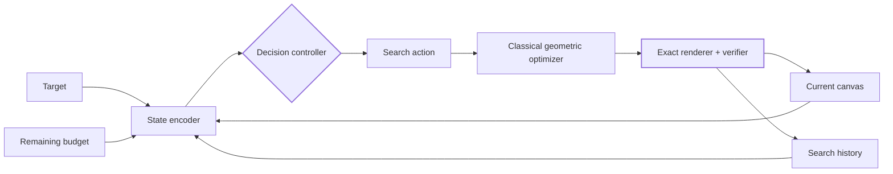

<div align="center">

# faint

### Learned compute allocation for geometric image abstraction

**A research project exploring how calibrated decision models can control classical geometric search without replacing its exact renderer or verifier.**

[](#research-status)
[](https://github.com/fogleman/primitive)
[](#)

</div>

---

## The idea

[`fogleman/primitive`](https://github.com/fogleman/primitive) recreates an image by repeatedly searching for one geometric primitive that reduces reconstruction error. It is elegant, interpretable, and exact — but much of its compute is spent exploring candidate shapes and mutations that do not help.

**Faint asks a different question:**

> Can a learned decision policy decide **where a geometric optimizer should spend its next unit of compute**?

The model does **not** generate SVG code and does **not** get final authority over the image. Instead, it observes the current residual and search history, then chooses a search configuration: primitive family, spatial region, proposal budget, mutation family, restart count, or local optimization budget. The existing renderer evaluates the result exactly.



### Neural intuition. Classical optimization. Exact verification.

Faint is deliberately hybrid:

- **Decision model** — predicts which computation is worth trying next.
- **Geometric optimizer** — performs continuous/discrete search.
- **Renderer + metric** — remains the source of truth.
- **Fallback policy** — broadens search when the controller is uncertain.

This turns image abstraction into a **dynamic algorithm configuration** problem rather than another end-to-end neural painter.

---

## Why this direction

A simple "AI chooses the next shape" idea overlaps heavily with existing work. LIVE already progressively places vector paths in poorly reconstructed regions. Neural Primitive Assembly directly predicts primitive assignments and parameters. RL painters learn sequential strokes. Render-in-the-Loop gives SVG models visual feedback after intermediate rendering.

The more interesting gap is one level higher:

> **Learn the search policy, while preserving the exact optimizer and verifier.**

Faint focuses on **quality per evaluation / quality per millisecond**, not only final reconstruction quality.

---

## Core research question

Given optimizer state \(s_t\), a set of available search actions \(A_t\), and a finite compute budget, learn a policy

\[
\pi(a \mid s_t, A_t, B_t)
\]

that maximizes improvement while minimizing search cost.

A candidate utility is:

\[
U(a,s) = \Delta E(a,s) - \lambda C(a) - \mu K(a)
\]

where:

- \(\Delta E\) = reconstruction improvement,
- \(C\) = compute / renderer evaluations,
- \(K\) = representation complexity.

The exact objective is intentionally benchmarkable: the original optimizer can evaluate multiple actions from the same state and provide **counterfactual supervision** without human labels.

---

## Experiment zero

Before training a neural model, Faint must prove that a learnable configuration gap exists.

For the **same canvas state**, run many different search configurations:

```text
state S
 ├─ triangle · local · 64 proposals   → gain 0.0050 · cost 64
 ├─ ellipse  · global · 256 proposals → gain 0.0019 · cost 256
 ├─ rotated rectangle · local · 32    → gain 0.0041 · cost 32
 └─ mixed · global · 1000             → gain 0.0054 · cost 1000
```

Then compare:

```text
best fixed configuration
        vs.
per-state oracle configuration
```

If the oracle barely beats the best static configuration, the learning idea is weak. If the gap is substantial, Faint has a real target to learn.

---

## Research map

The full research package lives in [`research/`](./research/README.md).

| Document | Contents |
|---|---|
| [`01-primitive-codebase.md`](./research/01-primitive-codebase.md) | File-by-file analysis of `fogleman/primitive` and exact intervention points |
| [`02-related-work.md`](./research/02-related-work.md) | Image vectorization, neural painting, inverse graphics, differentiable rendering, DAC |
| [`03-decision-models.md`](./research/03-decision-models.md) | Jev, Laya, OpenAI Decisions, local-policy alternatives and deployment tradeoffs |
| [`04-novelty.md`](./research/04-novelty.md) | What is already crowded, what is still defensible, and the proposed contribution |
| [`05-architecture.md`](./research/05-architecture.md) | State, actions, controller, verifier, uncertainty and fallback design |
| [`06-experiments.md`](./research/06-experiments.md) | Oracle-gap test, datasets, baselines, metrics, ablations and staged execution |
| [`07-bibliography.md`](./research/07-bibliography.md) | Papers, repositories and primary links |

---

## Proposed controller actions

The controller should operate at a **macro-search** level, not on every pixel mutation.

```text
shape family      triangle / rectangle / ellipse / polygon / curve / mixed
region            global / residual top-k / edge-heavy / selected tile
scale             tiny / small / medium / large
proposal budget   32 / 64 / 128 / 256 / 512 / 1000
hill-climb age    16 / 32 / 64 / 100 / 192
restarts          1 / 2 / 4 / 8 / 16
mutation family   position / scale / angle / vertex / alpha / mixed
fallback          original broad Primitive search
```

The action space can later become dynamic, allowing new primitive operators to be introduced without redesigning the entire controller.

---

## Training without labels

The original optimizer acts as a teacher.

At selected states, Faint branches the optimizer and evaluates multiple actions from the **same starting canvas**. Exact outcomes create labels such as:

```json
{
  "state": "S_00421",
  "actions": {
    "triangle_local_64": {"gain": 0.0050, "evaluations": 64},
    "ellipse_global_256": {"gain": 0.0019, "evaluations": 256},
    "rot_rect_local_32": {"gain": 0.0041, "evaluations": 32}
  }
}
```

This supports ranking, utility prediction, calibrated classification, contextual bandits, offline RL, or later online adaptation.

---

## Baselines that matter

Faint should not be compared only against the original 2016-era search loop.

- Original **Primitive** hill climbing
- Tuned static Primitive configuration
- Residual / heatmap heuristic
- Random and greedy controllers
- Contextual bandit / UCB
- Modern evolutionary-search baseline
- **diffvg**-style differentiable optimization where representation permits it
- **LIVE**-style residual-guided initialization
- **Laya / Jev** structured decision controllers
- Small learned MLP/CNN/ViT controller
- Oracle per-state configuration

---

## Evaluation

The headline plot should be an **anytime curve**:

> reconstruction quality vs. exact renderer evaluations / wall-clock compute.

We also track:

- RMSE / MSE / PSNR / SSIM
- LPIPS and optional semantic similarity
- evaluations per accepted primitive
- wall-clock time
- primitive count / SVG complexity
- action regret against the oracle
- calibration (ECE / Brier score)
- fallback rate
- cross-domain generalization
- quality at fixed compute budgets

---

## Research status

- [x] Analyze the original Primitive search loop
- [x] Map surrounding vectorization / painting literature
- [x] Identify overlap with residual-guided path placement and direct primitive prediction
- [x] Reframe as dynamic algorithm configuration / metareasoning
- [x] Design counterfactual supervision
- [ ] Port / instrument the baseline optimizer
- [ ] Build the oracle-gap benchmark
- [ ] Implement static + heuristic controllers
- [ ] Add decision-provider interface
- [ ] Evaluate Laya / Jev in shadow mode
- [ ] Train a local cost-aware policy
- [ ] Run ablations and cross-domain evaluation

---

## One-line thesis

> **Faint learns how an exact geometric optimizer should spend its computation.**

Not a neural painter. Not an SVG language model. A learned controller for search.
