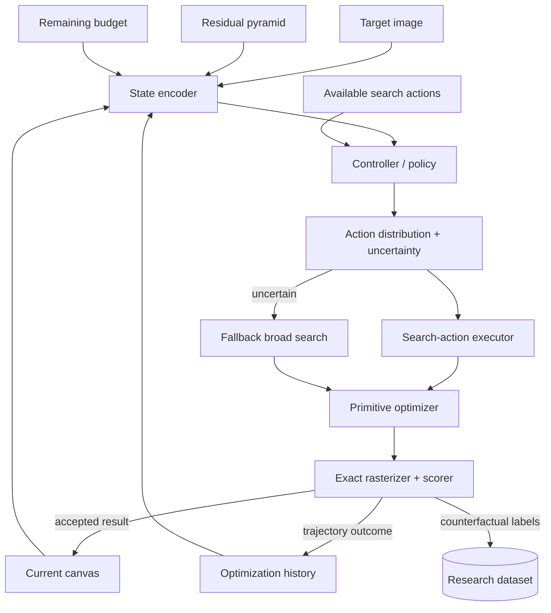
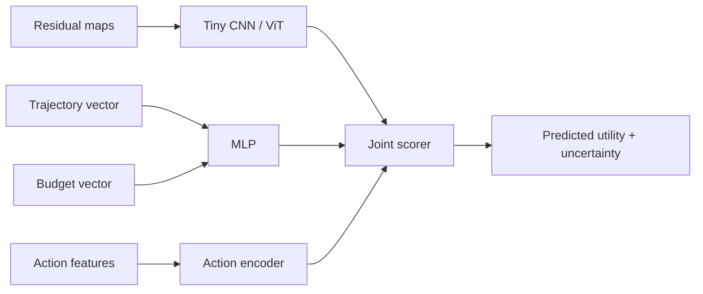

# 05 — Proposed Architecture

Faint is a **learned controller around a classical geometric optimizer**.

The learned component decides which search computation is worth executing; the renderer and objective remain exact.

---

## System overview



---

## 1. State representation

The controller should observe **visual state**, **search dynamics**, and **budget state**.

### Visual features

At minimum:

- target/current residual,
- multi-scale error map,
- edge magnitude,
- dominant edge orientation,
- local RGB residual statistics,
- local variance / entropy,
- accepted primitive density,
- recent search coverage.

A first implementation can downsample into fixed tiles:

```text
8×8 grid
```

For every tile:

```text
mean absolute / squared residual
mean RGB residual
variance
edge density
orientation histogram
recent accepted-shape count
recent attempted-proposal count
```

This is cheap enough to serialize for Laya/Jev and simple enough for an MLP baseline.

### Trajectory features

These make Faint a search controller rather than a visual classifier.

Possible features:

```text
current reconstruction score
score delta over last 1/4/8/16 accepted shapes
candidate evaluations per accepted shape
hill-climb acceptance rate
restart success rate
best/worst recent operator
shape-family reward moving averages
region reward moving averages
mutation-family reward moving averages
number of consecutive low-gain steps
```

### Budget features

```text
remaining renderer evaluations
remaining wall-clock budget
remaining primitive count
fraction of budget consumed
```

Budget-conditioned control should allow the same policy to behave differently under fast-preview vs high-quality modes.

---

## 2. Action representation

A macro search action can be represented as:

```go
type SearchAction struct {
    ShapeFamily   ShapeFamily
    RegionPolicy  RegionPolicy
    ScalePrior    ScalePrior
    AnglePrior    AnglePrior
    MutationMode  MutationMode
    Candidates    int
    HillAge       int
    Restarts      int
}
```

Example actions:

```text
triangle / top-residual-region / small / free-angle / vertex / 64 / 32 / 2
ellipse / global / large / n-a / scale / 128 / 64 / 4
rot-rect / edge-heavy / medium / aligned / mixed / 32 / 96 / 2
mixed / global / medium / free / mixed / 1000 / 100 / 16
```

The last one acts as a broad-search fallback similar to the original Primitive behavior.

---

## 3. Dynamic action sets

A fixed classifier over 500 hard-coded configurations is easy but limiting.

A stronger controller scores state/action pairs:

\[
q(s,a)=f(\phi(s),\psi(a))
\]

This allows the action portfolio to change over time.

For example, after adding a new `RoundedPolygon` primitive, we can add new actions without replacing the policy's output head.

---

## 4. Controller output

The controller should output more than a hard class.

Preferred output:

```json
{
  "actions": [
    {"id": "a1", "utility": 0.73, "probability": 0.51},
    {"id": "a2", "utility": 0.68, "probability": 0.33},
    {"id": "a3", "utility": 0.41, "probability": 0.11},
    {"id": "fallback", "utility": 0.23, "probability": 0.05}
  ],
  "uncertainty": 0.29
}
```

Useful targets include:

- expected score improvement,
- expected utility,
- expected evaluations to improvement,
- probability action is top-k,
- calibrated action distribution.

---

## 5. Utility

Initial utility should be simple and interpretable.

### Evaluation-cost utility

\[
U(a,s)=\Delta E(a,s)-\lambda N_{eval}(a)
\]

### Representation-aware utility

\[
U(a,s)=\Delta E(a,s)-\lambda N_{eval}(a)-\mu K(a)
\]

where `K` can represent primitive complexity or SVG size.

### Runtime-aware utility

Hardware-specific studies can use measured time:

\[
U_{time}=\Delta E-\lambda T_{ms}
\]

It is useful to keep raw outcomes as separate labels so utility weights can change later without regenerating the dataset.

Store:

```text
score_before
score_after
evaluations
wall_ms
accepted primitive count
representation complexity
```

not only one scalar reward.

---

## 6. Exact search executor

The controller never directly alters `Current`.

Execution flow:

```text
controller chooses action
       ↓
instantiate candidate prior
       ↓
generate/evaluate proposals
       ↓
local optimizer / hill climb
       ↓
select best exact candidate
       ↓
accept only if objective improves
```

This preserves a clean experimental boundary between policy quality and renderer correctness.

---

## 7. Counterfactual branch evaluator

This is the core research-data component.

At sampled states:

1. snapshot the current optimizer state,
2. enumerate a portfolio of candidate search actions,
3. execute each from the exact same snapshot,
4. record outcomes without mutating the canonical trajectory,
5. rank actions by chosen utility.

Pseudo-flow:

```text
                 ┌─ action A → outcome A
canonical state ─┼─ action B → outcome B
                 ├─ action C → outcome C
                 └─ action D → outcome D
                        ↓
                counterfactual row
```

This avoids noisy labels caused by comparing actions at different states.

---

## 8. Shadow mode

Before allowing a learned controller to affect rendering:

```text
controller predicts action
original algorithm still executes
```

Log:

```text
predicted action rank
oracle action
predicted utility
actual counterfactual utility
regret
confidence
```

This is ideal for Jev/Laya experiments because it separates controller quality from performance side effects.

---

## 9. Uncertainty-aware fallback

A robust policy should always have access to a broad baseline action.

Possible rule:

```text
entropy < low threshold
  → choose top action

entropy moderate
  → sample top-k / increase candidate budget

entropy high
  → fallback broad search
```

A more general approach includes search breadth directly in the action set and lets the policy learn when broad search is valuable.

---

## 10. Multi-level control

Do not start with all levels at once.

### Level 1 — macro budget control

Choose:

```text
shape family
region
candidate count
hill age
restarts
```

### Level 2 — proposal priors

Choose:

```text
scale
angle
location distribution
```

### Level 3 — mutation operator selection

Choose:

```text
position / radius / angle / vertex / alpha
```

Only add Level 3 if Level 1/2 show meaningful gains.

Remote decision models should almost certainly remain Level 1 only.

---

## 11. Local-policy architecture

A likely final lightweight model:



The action encoder can embed:

```text
shape type
region policy
scale bucket
mutation type
log candidate budget
log hill budget
log restarts
```

Training can use pairwise ranking, listwise ranking, or regression against measured outcomes.

---

## 12. Data schema

Suggested counterfactual record:

```json
{
  "image_id": "coco_000001",
  "trajectory_id": "run_17",
  "step": 44,
  "state": {
    "score": 0.1813,
    "budget_remaining": 14820,
    "visual_features": "features-v1://...",
    "trajectory_features": [0.0041, 0.0027, 0.0014]
  },
  "actions": [
    {
      "id": "triangle_local_64_h32_r2",
      "score_after": 0.1767,
      "evaluations": 221,
      "wall_ms": 1.73,
      "primitive_complexity": 1
    }
  ]
}
```

Keep raw images / residual snapshots separately if dataset scale makes inline storage expensive.

---

## 13. Engineering principle

Every learned choice must be removable behind an interface.

The code should support:

```text
--controller uniform
--controller static-best
--controller residual
--controller ucb
--controller laya
--controller jev
--controller local-policy
--controller oracle
```

This is essential for honest ablations and reproducibility.
